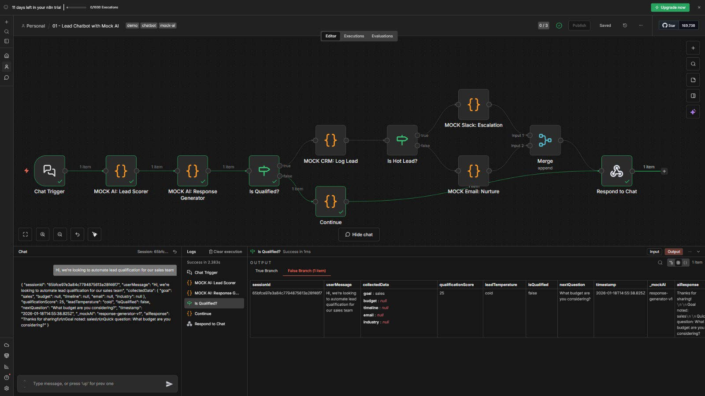
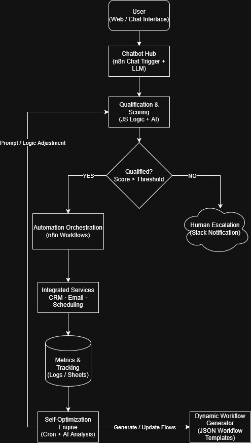

# Intelligent Automation System – AI Workflow Prototype

## Overview
This repository contains a prototype **AI-powered automation system** built using **n8n** as the core orchestration engine.  
It simulates a scalable, industry-agnostic workflow that handles **user engagement, qualification, automation, escalation, tracking, and continuous optimization**.

The project is designed to demonstrate **system thinking**, **workflow automation expertise**, and **AI-driven adaptability** under free-tier constraints, aligning directly with the **AI Automation Engineer** role requirements.

---
## Workflow Architecture

This diagram shows the complete automation flow including lead intake,
AI-based qualification, decision routing, and response generation.

---

## Objectives (Task Alignment)
This prototype was built to satisfy the pre-hiring task objectives:

- Basic chatbot for user engagement  
- Workflow automation for processing, routing, and outputs  
- AI features for decision-making and self-optimization  
- Tracking and escalation logic  
- “Living system” behavior through feedback loops  
- Deployable as reusable n8n workflow templates  

---

## High-Level Architecture

### Architecture Summary
- User interactions are handled through an AI-powered chatbot.
- Inputs are qualified using a combination of rule-based logic and AI scoring.
- Qualified requests trigger automated workflows across integrated services.
- Edge cases are escalated to humans for review.
- Metrics are logged and analyzed continuously.
- A self-optimization engine refines prompts and logic over time.
- The system supports dynamic workflow generation for scalable automation.

---

## Executable Workflows (Live Prototype)

These workflows are **fully runnable in n8n Cloud (free tier)** and form the working prototype.

### 1. Chatbot Hub – Lead Qualification & Automation
**File:** `workflows/n8n-01-chatbot-mock-ai.json`

**Flow:**
Chat Trigger
→ Mock AI Lead Scorer (JS Logic)
→ Mock AI Response Generator
→ Qualification Check
→ CRM Logging (Mock)
→ Email Nurture (Mock)
→ Slack Escalation (Mock)
→ Respond to Chat

**Demonstrates:**
- Public-facing chatbot using n8n Chat Trigger  
- Lead qualification and scoring logic  
- Automated routing and escalation  
- End-to-end working automation flow  
- Primary live demo workflow  

---

### 2. AI Council – Multi-Agent Decision System
**File:** `workflows/n8n-02-ai-council-mock.json`

**Flow:**
Webhook
→ Research Agent (Mock)
→ Strategy Agent (Mock)
→ Moderator
→ Decision Output

**Demonstrates:**
- Multi-agent AI council pattern  
- Separation of research, strategy, and synthesis  
- Reusable decision-making abstraction  

---

### 3. Self-Optimization Scheduler
**File:** `workflows/n8n-03-self-optimization-cron.json`

**Flow:**
Cron (Scheduled)
→ Mock Metrics Analysis
→ Optimization Decision
→ Logged Adjustment

**Demonstrates:**
- Continuous optimization  
- Feedback loop design  
- “Living system” behavior  

---

### 4. Dynamic Workflow Generator
**File:** `workflows/n8n-04-dynamic-workflow-gen.json`

**Flow:**
Webhook
→ Parse Request
→ Mock AI Workflow Generator
→ Output Workflow JSON Template

**Demonstrates:**
- Meta-automation  
- Dynamic workflow generation  
- Template-based scalability  

---

## Conceptual (Production-Intent) Workflows
The following workflows represent real-world implementations using actual APIs (OpenAI, CRM, analytics).  
They are included to demonstrate **production intent and system design**, but are not executed in the free-tier prototype.

- `01-chatbot-lead-qualification.json`
- `02-ai-council-multi-agent.json`
- `03-self-optimization-scheduler.json`
- `04-dynamic-workflow-generator.json`
- `05-metrics-dashboard-growth.json`

---

## Supporting Code & Configuration

### `src/utils.js`
- JavaScript utilities for scoring, formatting, and decision handling  
- Demonstrates how custom logic integrates into automation workflows  

### `src/config.json`
- Configuration abstraction for environment-based scaling  
- Represents template readiness and system portability  

> These files are architectural artifacts and not runtime dependencies for n8n.

---

## Assumptions & Constraints
- Free-tier tools only  
- No paid APIs required  
- AI behavior simulated using code nodes  
- Focus on orchestration, adaptability, and system design  
- Mirrors early-stage SaaS prototyping constraints  

---

## Live Prototype Access
🔗 **Live Workflow URL:**  
https://rickzzy-ai-automation.app.n8n.cloud/workflow/R2NWYP_5W3S9RLvxuJIed?projectId=OhdtGiDvxtEtpnQp&uiContext=workflow_list

> Note: The workflow is hosted on n8n Cloud free tier and will remain accessible during the evaluation window.
Due to n8n Cloud free-tier sharing limitations, the live prototype is also provided as **importable n8n workflow JSON templates**.

**Primary demo workflow:**
- `n8n-01-chatbot-mock-ai.json`

All executable workflows can be imported and run directly in **n8n Cloud**.

---

## Self-Evaluation  
### Designing a Living, Scalable AI Automation System for Real-World Deployment

This prototype was built to mirror the exact expectations outlined in the AI Automation Engineer role and pre-hiring task: designing an adaptive, end-to-end automation system that behaves as a “living” platform rather than a static workflow.

The system demonstrates strong workflow orchestration using n8n as the central engine, covering the full lifecycle from user engagement to qualification, automation, escalation, tracking, and optimization. Each major capability—chatbot hub, AI council, self-optimization scheduler, and dynamic workflow generator—is implemented as an independent, modular workflow. This architecture enables horizontal scaling across industries and vertical scaling from small teams to enterprise-level operations without redesigning the core system.

For real-world scaling, I would introduce tenant-aware configurations, persistent data stores, and production-grade AI integrations (OpenAI/Gemini/Claude with vector databases) to support long-term context, retrieval-augmented generation, and domain-specific intelligence. The self-optimization loop would evolve from rule-based logic into metrics-driven optimization using real conversion, CPA, and growth data, enabling automated A/B testing of prompts, routing logic, and escalation thresholds.

A key scalability lever is the dynamic workflow generator. In production, this would allow business teams to request new automations using natural language, with AI generating structured JSON workflows that require approval before deployment—balancing autonomy, safety, and control. Combined with dashboards and ROI benchmarks, this system can support outcome-based guarantees such as growth targets or automated refunds if performance thresholds are not met.

Overall, this prototype reflects my approach to automation engineering: architecting adaptable systems that evolve through feedback, prioritize measurable outcomes, and minimize manual intervention while retaining human oversight—aligning directly with AONXI’s vision of self-sustaining, data-driven operations.

